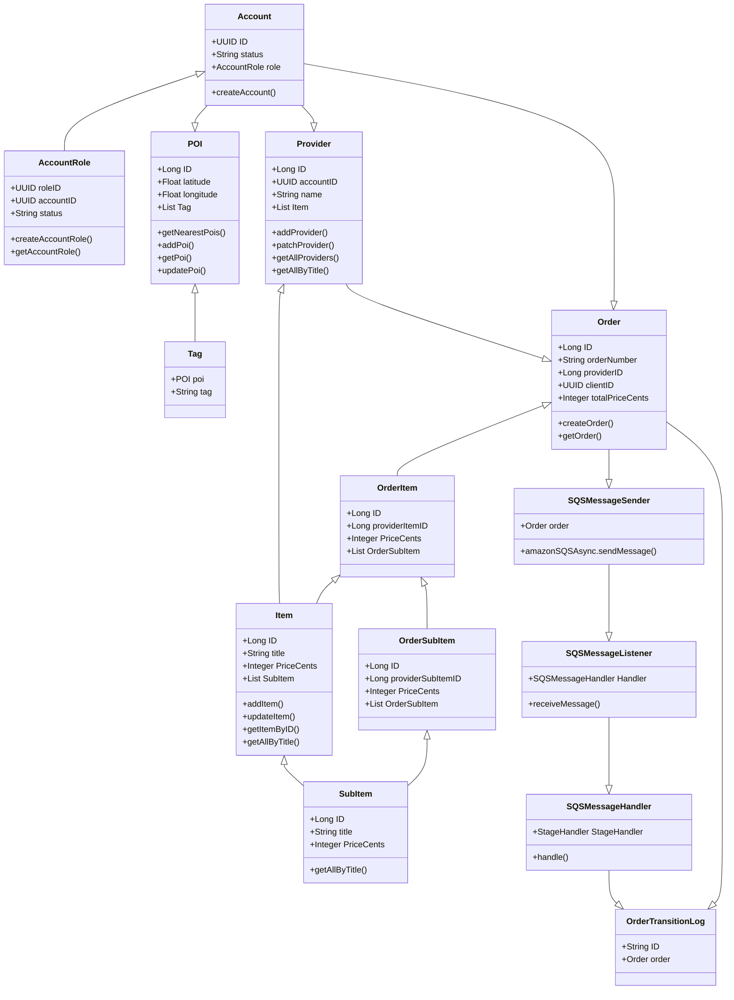

# Account service

Part of a multi module project. Handles accounts and their respective roles.

## Class Diagram



## Features

- Store account data and roles
- CRUD operations for accounts and roles
- Account role verification
- Unit and integration tests for positive and negative scenarios
- Code generation using openAPI
## Tech Stack

- Java Spring Boot
- PostgreSQL
- Dockerfile and docker-compose file
- Custom network inside docker-compose file, same with [Provider-service](https://github.com/NikoIskra/provider-service)
- Spotless Gradle
- GitHub actions which ensure all tests pass and Spotless has been applied
- Flyway migration scripts
- API specification using OpenAPI specification

## API Reference

#### Healtcheck

```http
  GET /api/v1/healthcheck
```

#### Create account [.http file](https://github.com/NikoIskra/account-service/blob/main/requests/create_account.http)

```http
  POST /api/v1/account
```

Request body:

| Parameter | Type     | Description                       |
| :-------- | :------- | :-------------------------------- |
| `email`      | `string` | **Required**. account email, > 5 characters |
| `password`      | `string` | **Required**. account password, alphanumeric and > 8 characters long |
| `username`      | `string` | **Optional**. account username |


#### Create account role [.http file](https://github.com/NikoIskra/account-service/blob/main/requests/create_account_role.http)

```http
  POST /api/v1/account/{account-id}/role
```

Header: 

| Parameter | Type     | Description                       |
| :-------- | :------- | :-------------------------------- |
| `account-id`      | `uuid` | **Required**. id of account to set role |

Request body:
| Parameter | Type     | Description                       |
| :-------- | :------- | :-------------------------------- |
| `role`      | `string` | **Required**. role to assign. Possible values: ["client", "provider", "delivery", "manager"]|
| `status`      | `string` | **Optional**. role status. Possible values: ["active", "revoked"] |

#### Get account role [.http file](https://github.com/NikoIskra/account-service/blob/main/requests/get_account_role.http)

```http
  GET /api/v1/account/{account-id}/role/{role}
```

Header: 

| Parameter | Type     | Description                       |
| :-------- | :------- | :-------------------------------- |
| `account-id`      | `uuid` | **Required**. id of account to get account role id |
| `role`      | `string` | **Required**. role of account to get account role id. Possible values: ["client", "provider", "delivery", "manager"] |

## Database model
Account:

- `ID : uuid`
- `Username : string`
- `Password : string`
- `Status : string`
- `CreatedAt : timestamp`
- `UpdatedAt : timestamp`

Account Role:

- `ID : uuid`
- `AccountID : uuid`
- `role : string`
- `Status : string`
- `CreatedAt : timestamp`
- `UpdatedAt : timestamp`

## Environment Variables

To run this project, you will need to add the following environment variables to your .env file

`DB_HOST`

`POSTGRES_DB`

`POSTGRES_USER`

`POSTGRES_PASSWORD`


## Run Locally

Clone the project

```
  git clone https://github.com/NikoIskra/account-service
```

Go to the project directory

```
  cd account-service
```

Build .jar file

```
  ./gradlew build
```

Start WSL and locate service directory

```
  cd /mnt/c/account-service
```

Run docker compose

```
docker compose up
```

